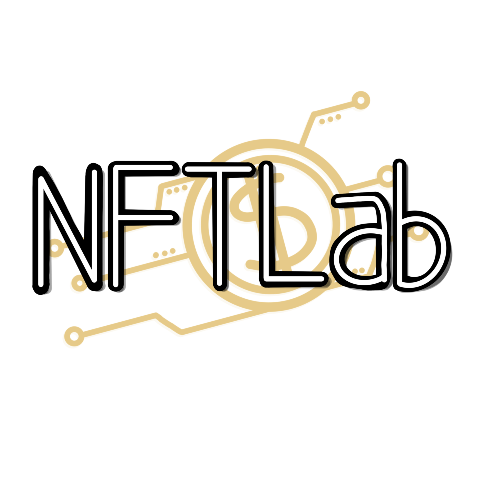

# NFT Lab - front-end with Angular framework

  
 

## Getting started

Make sure you have the [Angular CLI](https://angular.io/cli) installed globally. We use [npm](https://www.npmjs.com/) to manage the dependencies, so we strongly recommend you to use it. Clone this repository locally and then run `npm install` to resolve all dependencies (might take a minute).

Run `ng serve` for a dev server. Navigate to `http://localhost:4200/`. The app will automatically reload if you change any of the source files.

## Building the project

Run `ng build` to build the project. The build artifacts will be stored in the `dist/` directory. Use the `-prod` flag for a production build.

## Test

### Unit tests

Run `ng test` to execute all unit test, add the flag `--code-coverage` to create `coverage` folder and update. At the next push this will update Coveralls values through the github action.

### E2E tests

Functionality tests are made with [taiko](https://taiko.dev/). To execute them, install taiko with `npm install -g taiko`, located on the e2e folder and run the command `taiko <script name>.js`.
